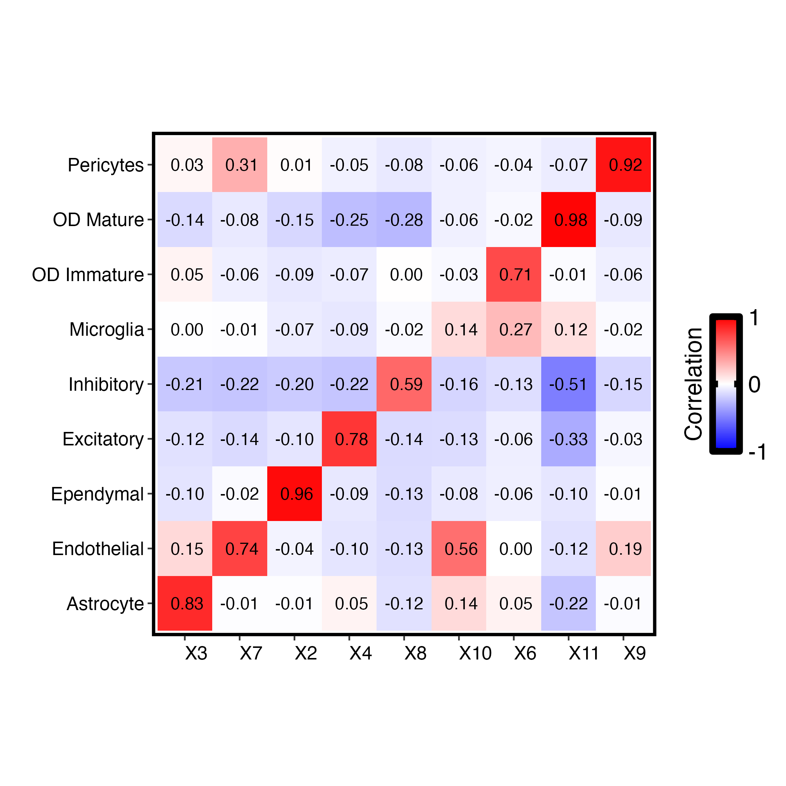
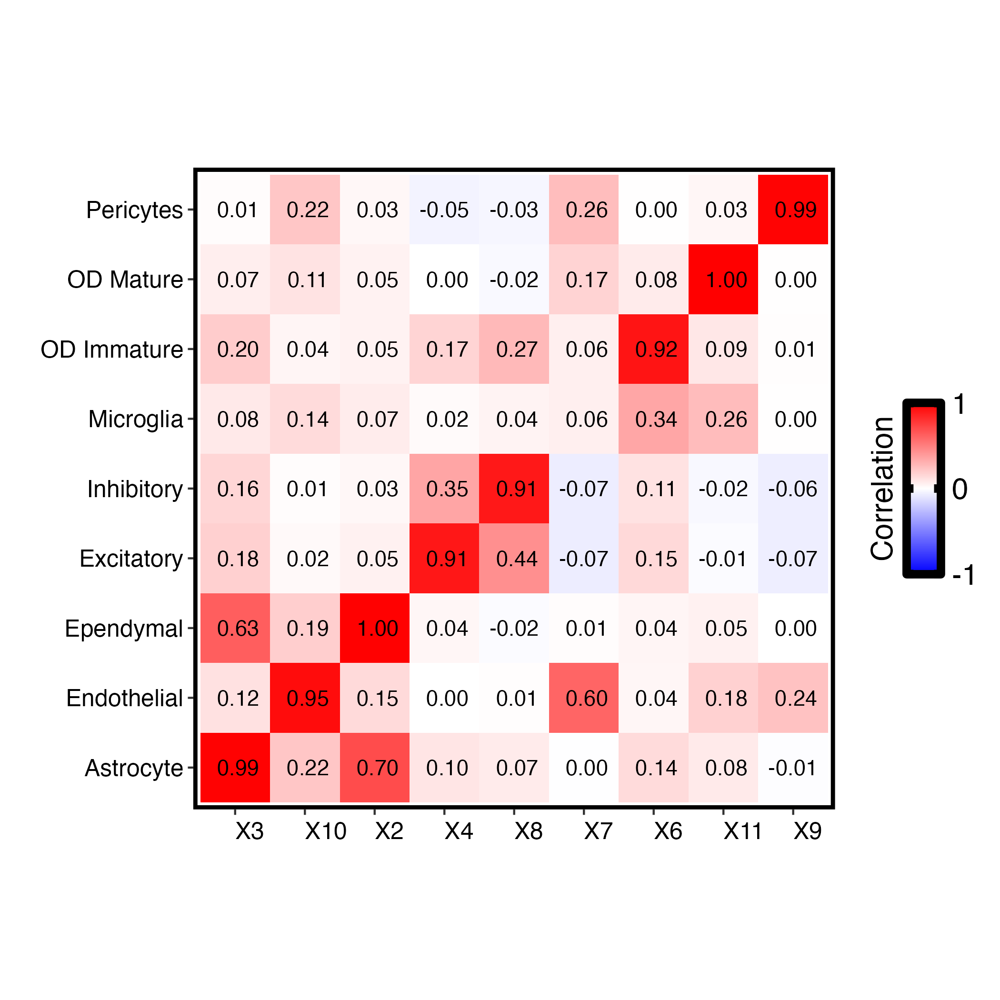
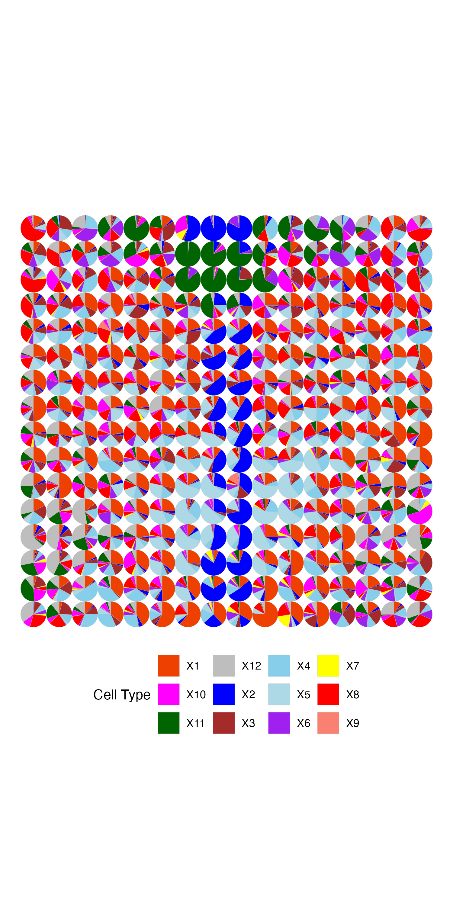

# SpatioNet

**SpatioNet** is a reference-free deconvolution framework for spatial transcriptomics data. It estimates spatially resolved cell type proportions and transcriptional profiles directly from spatial gene expression data, without requiring an external single-cell RNA-seq reference.

SpatioNet integrates **gene-network** and **spatial-network** to encourage biologically meaningful gene-topic structure and spatially coherent topic patterns across neighboring tissue locations.

# Reference
Vo, P. and Y. Cui. SpatioNet integrates spatial and gene-network regularization for reference-free deconvolution of spatial transcriptomics.

## Highlights

- **Reference-free spatial deconvolution**  
  Estimates latent cell-type proportions without relying on an external single-cell reference.

- **Gene-network-guided modeling**  
  Incorporates gene-gene network information to improve the biological structure and interpretability of gene-topic profiles.

- **Spatially regularized topic weights**  
  Encourages neighboring spots to have coherent cell type compositions while preserving local tissue heterogeneity.

- **Downstream-ready outputs**  
  Provides estimated cell type compositons and transcriptional matrices for visualization, clustering, marker interpretation, and downstream spatial analysis.

## Method Flowchart


## Installation

Install the repository in editable mode:

```bash
git clone https://github.com/Cui-STT-Lab/SpatioNet.git
cd SpatioNet
pip install -e .
```

## Dependencies

```python
import pandas as pd
import numpy as np
import os
import logging
import pickle
```

## Run SpatioNet with MPOA Data

### Data Loading and Preprocessing

The SpatioNet workflow starts by loading spatial transcriptomics data, gene network information, and spatial neighborhood graphs.

```python
from spationet.model.model import train

# Load feature matrix for all samples (corpus)
with open('data/raw/mpoa/MPOA_feat.pkl', 'rb') as f:
    feat = pickle.load(f)

# Load position information
pos = pd.read_csv('data/raw/mpoa/mpoa_pos.csv', index_col=0)

```

### Load Pre-computed Matrices

SpatioNet requires pre-computed feature matrices and gene networks:

```python
# Load gene network adjacency matrix
with open('data/STRING_processed/mpoa/mpoa_gene_network.pkl', 'rb') as f:
    M = pickle.load(f)

# Extract gene network weights
weight = pd.read_csv('data/STRING_processed/mpoa/mpoa_gene_network.csv')["abs_corr"].to_numpy()

# Load spatial difference matrices for spatial regularization
with open('data/spatial_processed/mpoa_diff.pkl', 'rb') as f:
    diff_matrix = pickle.load(f)
```

### Model Training

Train the SpatioNet model with graph regularization:

```python
# Set number of topics (cell types)
n_topics = 12

# Train SpatioNet model
lda = train(
    sample_features=feat,
    difference_matrices=diff_matrix,
    difference_penalty=10,
    M=M,
    weight=weight,
    n_topics=n_topics,
    n_iters=2,
    max_lda_iter=100,
    max_admm_iter=15,
    n_parallel_processes=8,
    save=True,
    output_dir="example/output/mpoa",
)
```

### Extract and Save Results

Extract topic-gene associations and spatial topic weights:

```python
# Extract results from trained model
beta = lda.components_.copy()
gamma = lda._unnormalized_transform(feat)

# Create result DataFrames
columns = [f"Topic-{i}" for i in range(n_topics)]
gamma_df = pd.DataFrame(gamma, index=feat.index, columns=columns)
beta_df = pd.DataFrame(lda.components_, columns=feat.columns, index=columns)

lda.topic_weights = gamma_df

# Save outputs
PATH_TO_MODELS = "example/output/mpoa"
os.makedirs(PATH_TO_MODELS, exist_ok=True)

# Save model
with open(f"{PATH_TO_MODELS}/model_topics={n_topics}.pkl", "wb") as f:
    pickle.dump(lda, f)

# Save spatial topic weights (gamma)
gamma_df.to_csv(f"{PATH_TO_MODELS}/gamma_topics={n_topics}.csv", index=True)

# Save topic-gene associations (beta)
beta_df.to_csv(f"{PATH_TO_MODELS}/beta_topics={n_topics}.csv", index=True)
```

## Example Outputs

### Cell type composition



### Cell type gene profiles



### Spatially cell type distribution


## Output Files

Typical outputs include:

- `model_topics=<n_topics>.pkl` — saved SpatioNet model
- `gamma_topics=<n_topics>.csv` — spatial topic weights per spot/pixel
- `beta_topics=<n_topics>.csv` — topic-gene contribution matrix
- `theta_PCC.png`, `beta_topics=<n_topics>.png`, `gamma_topics=<n_topics>.png` — example visualization files

## Project Structure

- `spationet/` — core model, data, and network modules
- `data/` — raw and processed MPOA datasets
- `example/output/` — example model outputs and figures
- `figures/` — visual summaries used in the README
- `scripts/` — training and experiment wrappers
- `tests/` — automated unit tests

## Notes

This README focuses on the model and visual results. Detailed extraction and evaluation workflows are available in the repository notebooks and scripts.

## License

This project is licensed under the MIT License.
