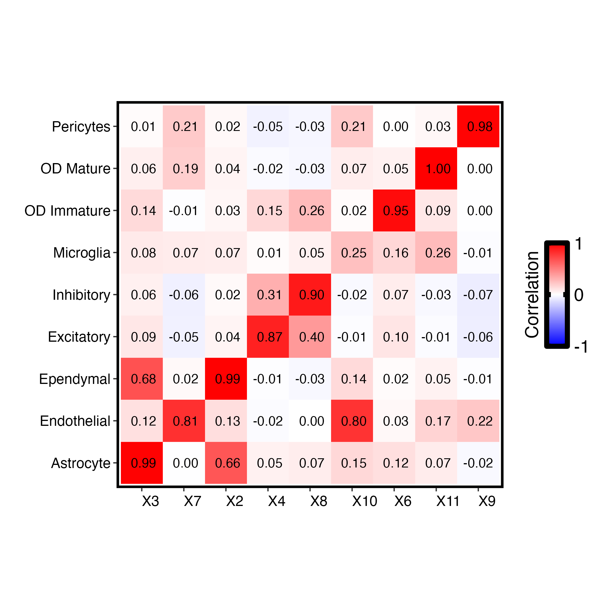

# SpatioNet

SpatioNet is a spatial transcriptomics framework for reference-free deconvolution using gene-network priors and spatial regularization. It combines network-informed topic modeling with spatial smoothing to recover spatial topic weights and gene-topic profiles without requiring an external single-cell reference.

## Highlights

- Reference-free deconvolution for spatial transcriptomics
- Gene-network priors to regularize gene-topic relationships
- Spatial smoothing via ADMM regularization on spatial priors
- Output-ready topic weights and gene-topic matrices for downstream analysis

## Installation

Install the repository in editable mode:

```bash
git clone https://github.com/Cui-STT-Lab/SpatioNet.git
cd SpatioNet
pip install -e .
```

## Quick Start

Train SpatioNet on your processed spatial transcriptomics data using the provided Python API. The model learns:

- spatial topic weights (`gamma`)
- topic-gene associations (`beta`)
- an optional saved topic model object

Outputs are written to a user-defined directory for analysis and visualization.

## Example Outputs

### Spatial topic concordance


### Topic-gene structure



### Brain-region reference overview


## Output Files

Typical outputs include:

- `model_topics=<n_topics>.pkl` — saved SpatioNet model
- `gamma_topics=<n_topics>.csv` — spatial topic weights per spot/pixel
- `beta_topics=<n_topics>.csv` — topic-gene contribution matrix
- `theta_PCC.png`, `beta_topics=<n_topics>.png`, `gamma_topics=<n_topics>.png` — example visualization files

## Project Structure

- `spationet/` — core model, data, and network modules
- `data/` — raw and processed MPOA datasets
- `example/output/` — example model outputs and figures
- `figures/` — visual summaries used in the README
- `scripts/` — training and experiment wrappers
- `tests/` — automated unit tests

## Notes

This README focuses on the model and visual results. Detailed extraction and evaluation workflows are available in the repository notebooks and scripts.

## Citation

If you use SpatioNet in your research, please cite:

```
Vo, Phuong, and Yuehua Cui. (2026) Leveraging gene networks for spatially-informed reference-free deconvolution in spatial transcriptomics with SpatioNet.
```

## License

This project is licensed under the MIT License.
